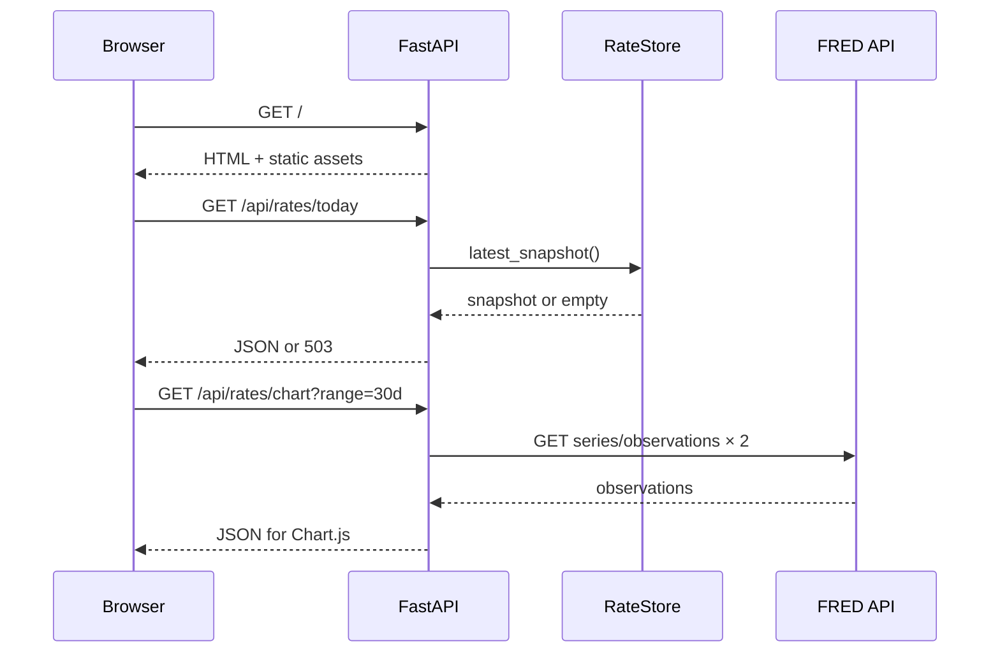
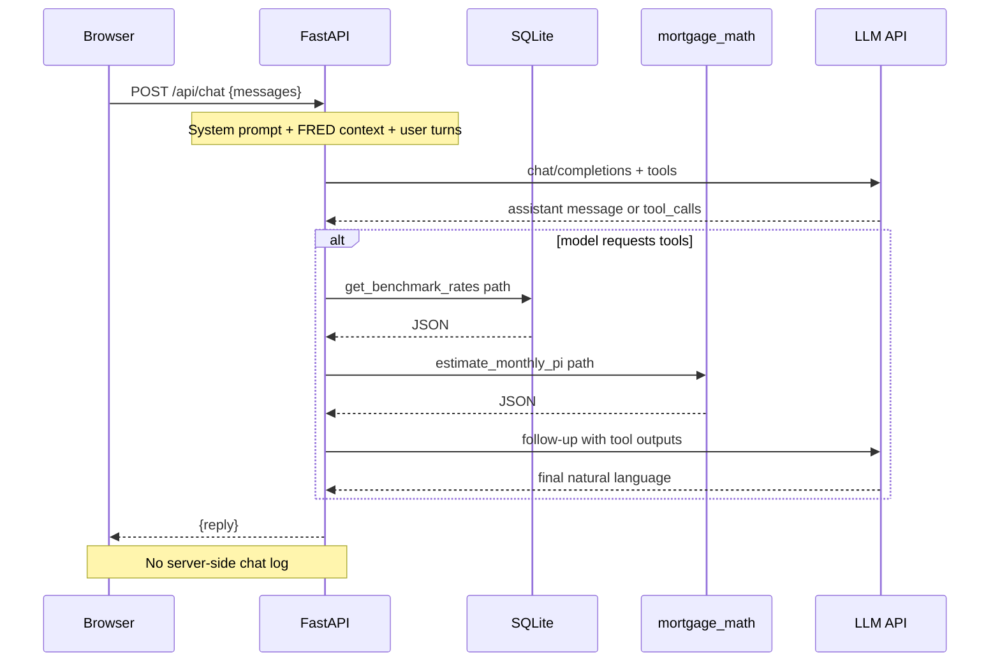
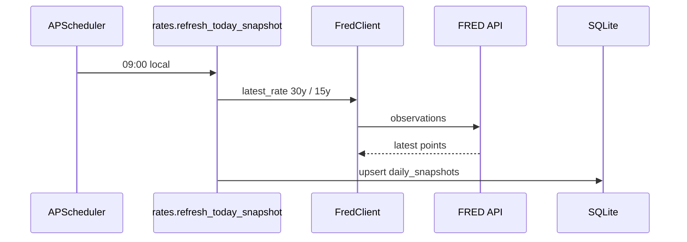
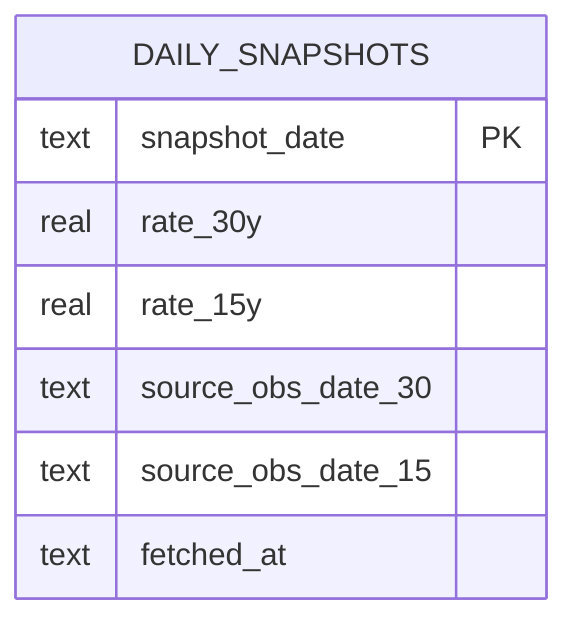

# US Homes Mortgage Rates: A Dual-Surface App Combining Macro Data (FRED), Scheduled Snapshots, and a Tool-Using LLM Assistant

*Technical article draft for engineering magazines or practitioner blogs. Tone: architecture-first, implementation-honest. Adjust length and house style per publication.*

**Abstract.** This article describes an open, small-footprint web application that (1) surfaces **national** 30-year and 15-year fixed mortgage benchmarks from the **FRED** API with **SQLite** caching and a **daily** scheduled refresh, and (2) exposes a **first-time homebuyer education** experience powered by a **large language model** with **function calling** to ground responses in the same benchmark data and **deterministic** payment math. The implementation uses **FastAPI**, **httpx**, **APScheduler**, and a **browser-only** chat history (no conversational persistence server-side). The LLM integration targets **OpenAI’s Chat Completions API** in production but is **provider-agnostic**: any service that implements a compatible **`/v1/chat/completions`**-style endpoint can be used via configuration.

---

## 1. Purpose

### 1.1 Macro transparency

The application gives U.S. readers a **single, reproducible** view of:

- **Headline national benchmarks** for **30-year** and **15-year** fixed-rate mortgages.
- **Historical context** through an interactive chart with selectable windows (7 days, 30 days, 90 days, one year).

The intent is **not** to replace a loan officer or to imply a lender-specific price, but to anchor discussion in **documented, programmatically fetchable** series rather than scraped news pages or opaque aggregators.

### 1.2 Education for first-time buyers

A separate surface (**“First-time buyers”**) hosts a **conversational assistant** that explains concepts (pre-approval, P&amp;I vs PITI, comparing Loan Estimates, rate environment) in plain language. The assistant is **educational only**—not legal, tax, or underwriting advice—and is designed to **avoid collecting sensitive identifiers** (no SSN, full address, or account numbers in product flows; server does not store chat transcripts).

Together, these surfaces address two different needs: **quantitative grounding** (rates) and **guided learning** (LLM), without conflating them.

---

## 2. Problem

### 2.1 Unreliable “rates today” extraction

Many consumer finance pages embed rates inside **editorial HTML**. Layout changes break scrapers; terms of service often restrict automation; and headline numbers may not map cleanly to a **single statistical definition** (e.g. national average vs lender-specific quote).

### 2.2 Mismatch of expectations: daily UI vs weekly macro series

The most widely cited **free, government-aligned** national series for conventional 30-year and 15-year fixed rates (Freddie Mac’s Primary Mortgage Market Survey, exposed on FRED as `MORTGAGE30US` and `MORTGAGE15US`) updates on a **weekly** cadence. Users often expect **daily** movement. Without clear UX and **observation dates**, the product looks “broken” when numbers are unchanged for several days.

### 2.3 Information overload without decision scaffolding

First-time buyers face jargon-heavy processes. A static chart does not answer “what should I read next?” A **conversational layer** can reduce friction **if** outputs are **grounded** (current benchmarks, deterministic amortization math) and **bounded** (disclaimers, refusal to handle sensitive data).

### 2.4 Operational constraints for open source

A reference implementation should:

- Minimize **paid proprietary** data dependencies (FRED remains free with registration).
- Keep **secrets** to environment variables (e.g. `FRED_API_KEY`, LLM API key)—never committed.
- Remain deployable as **one process** on modest hardware for demos and forks.

---

## 3. Scope

### 3.1 In scope

| Area | Scope |
|------|--------|
| **Geography** | United States; **national** benchmark series only (not state or MSA-specific pricing). |
| **Rates** | 30-year and 15-year **fixed** conventional benchmarks via FRED (`MORTGAGE30US`, `MORTGAGE15US`). |
| **Automation** | **Daily** job at **09:00** in a configurable IANA timezone to refresh a **server-side snapshot** of the latest FRED observations. |
| **Visualization** | Chart.js line chart for user-selected lookback windows. |
| **Assistant** | Web UI at `/assistant`; **LLM** with **tools** for benchmark lookup and **P&amp;I** estimation; **no** server-side storage of user messages. |
| **Privacy posture** | No user accounts; conversational history kept in the **browser** for the session; prompts are sent to the **LLM provider** when the user sends a message (provider’s terms apply). |

### 3.2 Out of scope (explicit non-goals)

- **Lender matching**, **credit pulls**, or **real-time** loan pricing.
- **Personalized** legal, tax, or investment advice.
- **Guaranteed** daily changes in benchmark numbers (weekly underlying series).
- **Multi-tenant** production hardening (rate limiting, abuse monitoring) beyond basic message-size limits—left as an exercise for operators.

---

## 4. Solution overview

### 4.1 Stack

| Concern | Implementation | Rationale |
|---------|------------------|-----------|
| **Macro data** | [FRED](https://fred.stlouisfed.org/) REST API | Official time series; documented; programmatic access with a free API key. |
| **HTTP client** | **httpx** (async) | Shared client for FRED and LLM HTTP calls. |
| **API framework** | **FastAPI** | Async routes, OpenAPI schema, small surface area. |
| **Rate cache** | **SQLite** (`daily_snapshots`) | Persists latest successful snapshot per calendar day; supports `/api/rates/today` without hitting FRED on every read. |
| **Chart series** | FRED **on demand** per request | Avoids building a large historical ETL; trades repeated API calls for simplicity. |
| **Scheduling** | **APScheduler** (`CronTrigger`, in-process) | Daily poll at 09:00 local to configured timezone. |
| **Rates UI** | Jinja2 **templates** + static **CSS/JS** + **Chart.js** (CDN) | No SPA build pipeline; easy to fork. |
| **Navigation** | Left **sidebar** (responsive: collapses to top on narrow viewports) | Clear separation between “Rates & chart” and “First-time buyers.” |
| **Assistant** | **Chat Completions** + **tools** (function calling) | Grounding + deterministic math alongside natural language. |
| **LLM provider (this repo)** | **OpenAI-compatible** HTTPS JSON API | Default base URL `https://api.openai.com/v1`; override for other hosts. |

### 4.2 “Honest” product behavior

- **Scheduler is daily**; **FRED observations** for these series are **weekly**. Copy and API payloads expose **FRED observation dates** so users understand why values may repeat across days.
- **Assistant** uses **tools**: `get_benchmark_rates` reads the same SQLite snapshot as the tiles; `estimate_monthly_pi` uses **closed-form amortization** in Python—**not** LLM arithmetic.

### 4.3 LLM provider flexibility

The code path uses the **Chat Completions** shape (`/chat/completions`) with optional **`tools`**. **OpenAI** is the default documented provider (`OPENAI_API_KEY`, `OPENAI_MODEL`, `OPENAI_BASE_URL`). In principle, **any** vendor that exposes a **compatible** endpoint and schema (including many **OpenAI-compatible** gateways and some **self-hosted** stacks) can be substituted by changing **`OPENAI_BASE_URL`** and the **API key**, subject to that vendor’s **tool-calling** support and authentication. *Integrators should verify tool calling and error semantics on their target stack.*

---

## 5. Architecture

### 5.1 Logical component diagram

```mermaid
flowchart TB
  subgraph Browser
    RATES[Rates page + Chart.js]
    ASST[Assistant page + chat UI]
  end

  subgraph "FastAPI single process"
    API[REST: / /assistant /api/*]
    RMOD[rates + FredClient]
    AG[agent_service: prompts + tool loop]
    MATH[mortgage_math]
    SCH[APScheduler]
    DB[(SQLite: daily_snapshots)]
  end

  FRED[FRED API]
  LLM[LLM HTTP API\n(OpenAI-compatible)]

  RATES --> API
  ASST --> API
  API --> RMOD
  API --> AG
  AG --> MATH
  AG --> DB
  RMOD --> DB
  RMOD --> FRED
  AG --> LLM
  SCH -->|daily| RMOD
```

### 5.2 Sequence: rates dashboard load



### 5.3 Sequence: assistant chat (tool loop)



### 5.4 Sequence: scheduled snapshot



### 5.5 Data model (server-side)



**Note:** User chat messages are **not** persisted in this schema; only **public benchmark snapshot** rows are stored.

---

## 6. Technical deep dive

### 6.1 FRED integration

- **Observations** endpoint with `observation_start` / `observation_end` for chart ranges.
- **Latest** values for snapshots: query a **recent window** and take the last non-`.` observation.
- **Missing values** encoded as `.` in FRED payloads—filtered before use.

### 6.2 SQLite snapshot semantics

Each successful daily refresh **upserts** a row for the **calendar snapshot date**, storing benchmark percentages and **source observation dates** from FRED, plus **`fetched_at`** for debugging.

### 6.3 Assistant: system prompt and guardrails

The system prompt instructs the model to:

- Stay within **education**, not legal/tax advice.
- **Refuse** to rely on or repeat sensitive identifiers.
- Prefer **tools** for current benchmarks and **P&amp;I** math.

### 6.4 Tools (function calling)

| Tool | Behavior |
|------|----------|
| `get_benchmark_rates` | Returns JSON from **SQLite** latest snapshot (same data as tiles). |
| `estimate_monthly_pi` | **Deterministic** fixed-rate monthly principal and interest via standard amortization; parameters include loan amount, annual rate (%), term (15 / 20 / 30 years). **Excludes** taxes, insurance, PMI. |

The model may issue **multiple** tool rounds; the implementation caps iterations to avoid runaway loops.

### 6.5 API surface (representative)

| Method | Path | Role |
|--------|------|------|
| GET | `/` | Rates dashboard |
| GET | `/assistant` | Assistant UI |
| GET | `/api/rates/today` | Latest snapshot JSON |
| GET | `/api/rates/chart` | Chart series for `range` query param |
| GET | `/api/assistant/status` | Whether LLM key is configured |
| POST | `/api/chat` | `{ "messages": [...] }` → `{ "reply": "..." }` |
| GET | `/api/health` | Liveness |

### 6.6 Frontend UX notes

- **Chart:** loading overlay and disabled range control during FRED fetches for long windows.
- **Assistant:** client-side **message history** only; errors surface inline.
- **Navigation:** left **sidebar** with labeled routes; **narrow screens** stack the sidebar above content.

---

## 7. Configuration and secrets

| Variable | Purpose |
|----------|---------|
| `FRED_API_KEY` | Required for macro data (free from FRED). |
| `SCHEDULE_TZ` | Timezone for the 09:00 job (e.g. `America/New_York`). |
| `DATABASE_PATH` | SQLite file path (default under `data/`; **gitignored**). |
| `OPENAI_API_KEY` | Enables assistant; omit to run **rates-only**. |
| `OPENAI_MODEL` | e.g. `gpt-4o-mini` (default in repo). |
| `OPENAI_BASE_URL` | Default `https://api.openai.com/v1`; override for compatible gateways. |

**Open source hygiene:** `.gitignore` excludes `.env`, `data/`, and common `*.db` patterns so local databases and keys are not published accidentally.

---

## 8. Deployment and operations

- Run behind **HTTPS**; terminate TLS at a reverse proxy or load balancer.
- Use a **process manager** or container with **restart** policy; probe **`/api/health`**.
- **Multi-replica caution:** in-process APScheduler runs **per replica**; externalize cron or leader election if you scale horizontally.
- **LLM costs and logging:** API usage is billed by the **provider**; enable **their** org policies, retention controls, and abuse monitoring for production.

---

## 9. Limitations and extensions

| Topic | Limitation | Extension |
|--------|------------|-----------|
| Geography | National series | Licensed regional indices or lender feeds. |
| Cadence | Weekly PMMS via FRED | Clear UX; optional daily indices if licensed. |
| Assistant | Single provider config | Multi-provider abstraction; streaming responses. |
| Testing | Manual / local | Contract tests against FRED mocks; golden tests for `mortgage_math`. |

---

## 10. Conclusion

This application combines **macro-financial transparency** (FRED, scheduling, charts) with a **grounded, tool-using LLM** for **first-time buyer education**, while keeping the **server-side database** limited to **non-PII benchmark snapshots**. The design is intentionally **small**, **forkable**, and **honest** about what weekly data can and cannot imply—useful as a **case study** in pragmatic full-stack architecture and responsible LLM integration.

---

## Suggested byline

*[Your name], [role] — builds data-backed tools at the intersection of public finance APIs and user-facing AI.*

---

## References

- FRED API: `https://fred.stlouisfed.org/docs/api/fred/`
- Series `MORTGAGE30US`, `MORTGAGE15US` — FRED series documentation and PMMS methodology.
- FastAPI: `https://fastapi.tiangolo.com/`
- Chart.js: `https://www.chartjs.org/`
- OpenAI API (Chat Completions): `https://platform.openai.com/docs/api-reference/chat` *(verify current docs for your chosen provider if substituting `OPENAI_BASE_URL`)*
